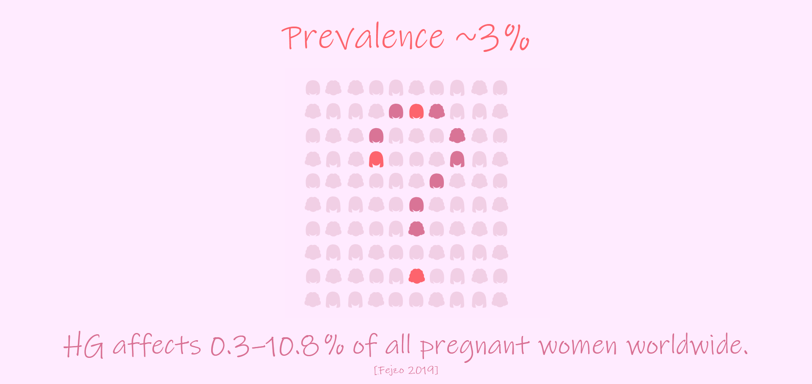
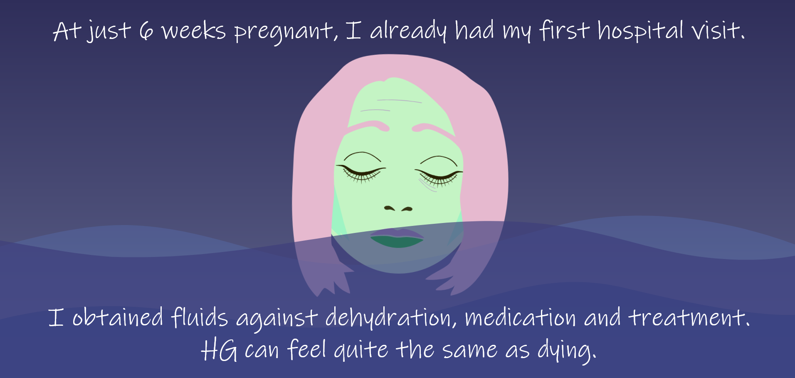
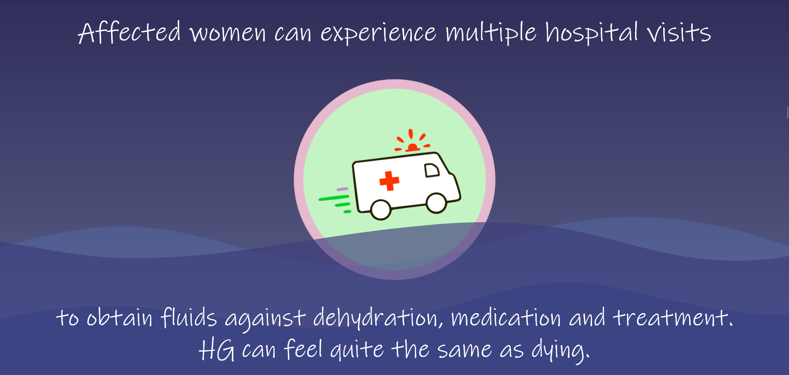
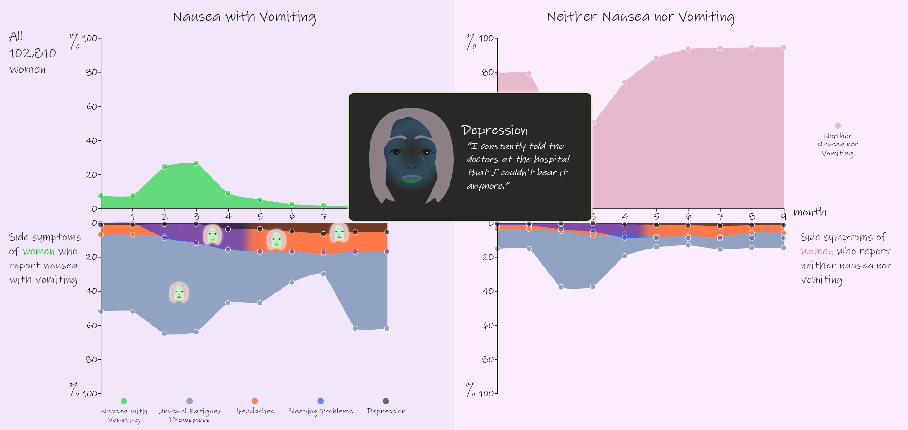
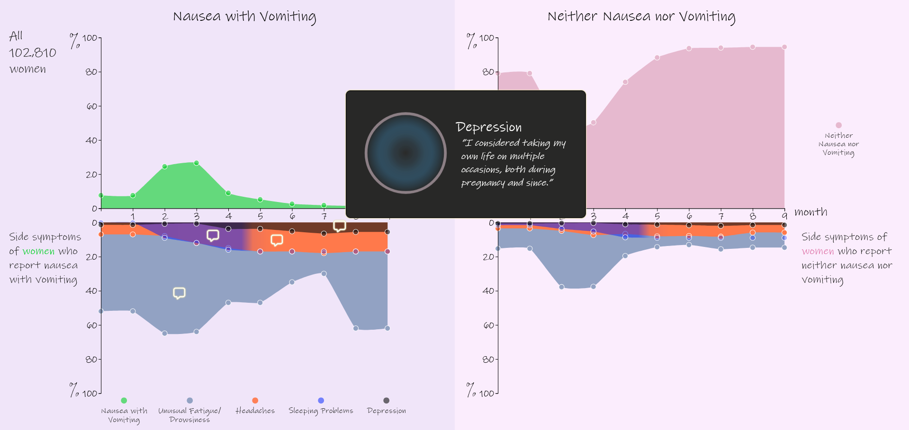
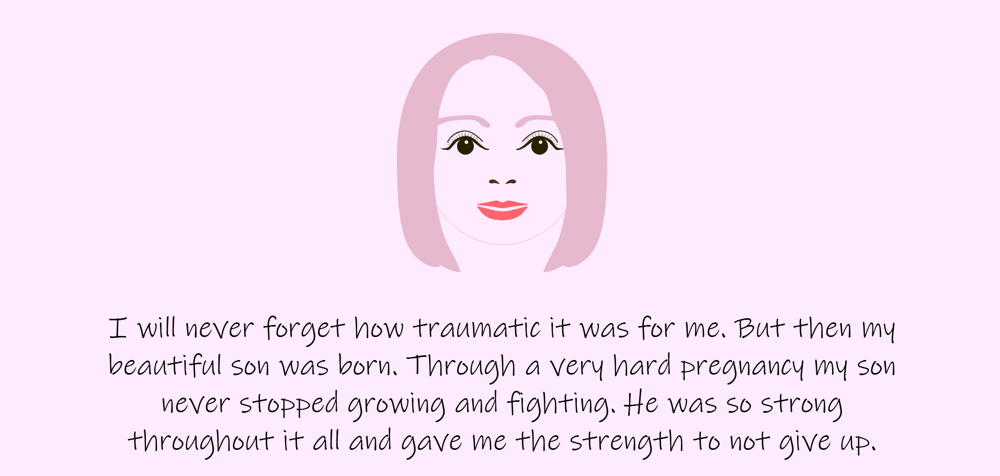
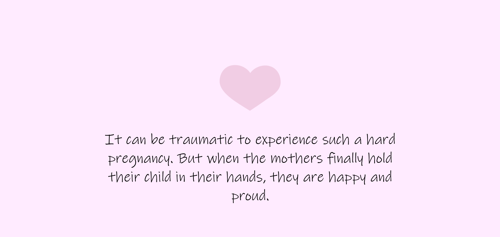

# “Visualizing untold stories through a human lens”

An interactive web application exploring how data visualization and narrative design can communicate personal experiences behind medical data.

The project focuses on Hyperemesis gravidarum (HG), a severe pregnancy condition, using data from the Norwegian Mother, Father and Child Cohort Study (MoBa). Built with HTML5, CSS3, JavaScript, and D3.js, the application combines interactive visualizations, illustration, animation, and storytelling elements to create an accessible and emotionally engaging experience.

---

## 💡 Motivation

This project explores how interactive visualization and storytelling can communicate personal experiences behind medical data.

Through this project, I had the opportunity to experiment with data visualization metaphors and raise awareness of a disease that is often overlooked or mistaken for normal pregnancy nausea.

--- 

## 🔬 Research and Data Exploration

As part of the project, exploratory analysis was conducted on subsets of MoBa data to investigate whether selected side symptoms differed between women affected by nausea and vomiting during pregnancy and those without symptoms.

The project development involved regular discussions with a bioinformatics researcher to better understand the medical and analytical context of the data.

The exploratory work and visualization concepts contributed to ideas that later became part of a multi-year research grant related to Hyperemesis gravidarum research.

---

## ✨ Features

- Interactive D3.js-based data visualizations
- Incremental chart construction and guided narrative flow
- Animated focus transitions for small-scale data patterns
- Illustration-driven UI with interactive quote elements
- Dual narrative perspectives:
 - an individual story centered around a human protagonist
 - a neutral, generalized data-driven perspective
- Iceberg metaphor for communicating visible and hidden aspects of disease experiences
- Responsive visual hierarchy and typography integration

---

## 📸 Narrative Comparison

### Narrative Introduction
| Individual Perspective | Collective Perspective |
|---|---|
|  |  |
| Personal narrative introduction | Statistical introduction to HG prevalence |

### Conflict and Disease Experience

| Individual Perspective | Collective Perspective |
|---|---|
|  |  |
| Emotional burden visualized through metaphor | Clinical emergency framing |

### Data Visualization

| Individual Perspective | Collective Perspective |
|---|---|
|  |  |
| Visualization combined with an individual voice | Visualization using collective patient experiences |

### Resolution

| Individual Perspective | Collective Perspective |
|---|---|
|  |  |
| Personal reflection and resolution | Collective reflection and summary |

---

## 🧬 MoBa Data Availability

Data from the Norwegian Mother, Father and Child Cohort Study used in this study are managed by the Norwegian Institute of Public Health and can be made available to researchers, provided approval from the Regional Committees for Medical and Health Research Ethics (REC), compliance with the EU General Data Protection Regulation (GDPR), and approval from the data owners. The consent given by the participants does not allow for the storage of data on an individual level in repositories or journals. Researchers who want access to data sets for replication should apply through helsedata.no. Access to data sets requires approval from the Regional Committee for Medical and Health Research Ethics in Norway and an agreement with MoBa.

Links: [MoBa – Norwegian Mother, Father and Child Cohort Study](https://www.fhi.no/en/ch/studies/moba/)

---

## 🛠 Tech Stack

- HTML5
- CSS3
- JavaScript
- D3.js

---

## 🎨 Design Notes

The UI combines data visualization with vector illustration to increase emotional engagement.

The project emphasizes:

- accessible visualization design
- readability and visual hierarchy
- harmonious color palettes

---

🧠 What I Learned

This project gave me practical experience with:

- designing interactive visualization flows
- structuring frontend-heavy applications
- translating sensitive medical topics into accessible visual communication
- balancing aesthetics, readability, and usability
- iterative design refinement through user feedback

---

## 🔭 Future Improvements

- Refactoring the project into a React-based architecture
- Creating reusable visualization and UI components
- Reducing code redundancy and improving maintainability
- Improving responsiveness across device sizes
- Enhancing accessibility and interaction patterns

---

## 📄 License

This project is licensed under the MIT License.
Copyright (c) 2026 Beatrice Budich
